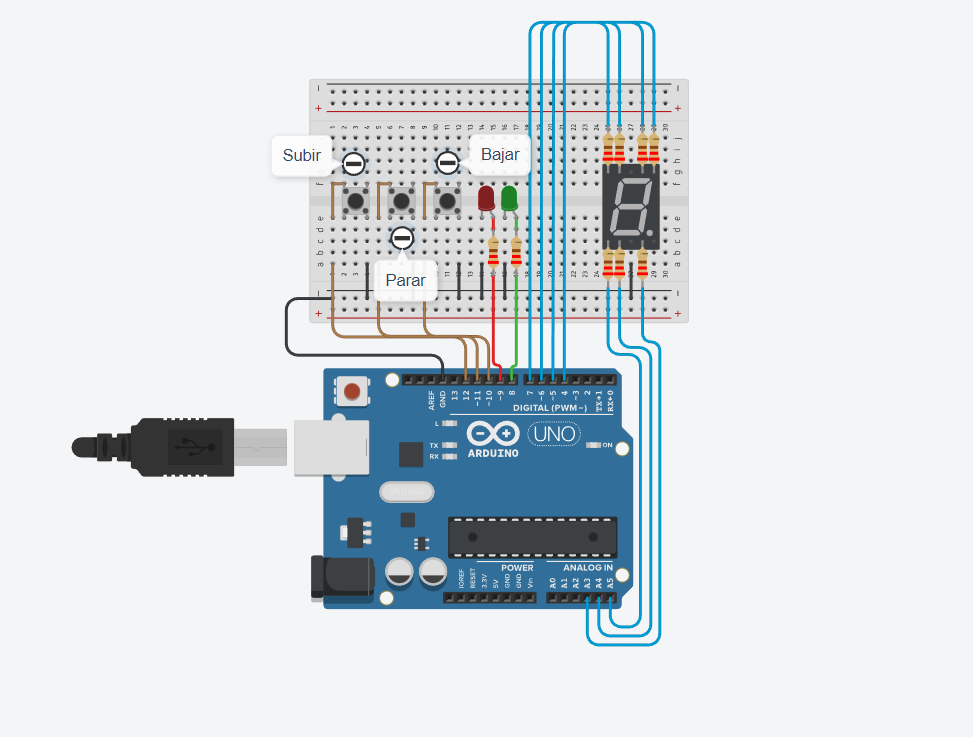

# Parcial SPD 

## Alumno
- Jorge L. Cabezas

## Proyecto: Montacargas.

## Descripción
El proyecto consiste en diseñar y construir un modelo de montacargas funcional como maqueta para un hospital. El objetivo principal es implementar un sistema que permita recibir órdenes de subir, bajar o pausar el montacargas desde diferentes pisos, y mostrar el estado actual del montacargas en un display de 7 segmentos.

El sistema cuenta con una interfaz de usuario que consta de tres botones: uno para subir pisos, otro para bajar pisos y otro para detener el montacargas. También se incluyen dos LEDs, uno verde que indica cuando el montacargas está en movimiento y otro rojo que indica cuando el montacargas está pausado. El display de 7 segmentos se utiliza para mostrar en tiempo real en qué piso se encuentra el montacargas.

## Funciones principales
Esta funcion se encarga de encender leds del 7 segmentos.

A, B, C, D, E, F, G son #define que utilizamos para conectar el display, asociandolo a pines de la placa arduino.

PrendeLed: Se pasa por parametro el pin que desea ser encendido y se pone en 0 el que no.
ApagarLeds: Apaga los leds del display 7 segmentos

~~~ C (lenguaje en el que esta escrito)
void prendeLed(int pin1, int pin2, int pin3, int pin4, int pin5, int pin6, int pin7) {
  digitalWrite(pin1, HIGH);
  digitalWrite(pin2, HIGH);
  digitalWrite(pin3, HIGH);
  digitalWrite(pin4, HIGH);
  digitalWrite(pin5, HIGH);
  digitalWrite(pin6, HIGH);
  digitalWrite(pin7, HIGH);
}

void apagarLeds() {
  for (int i = 4; i <= 7; i++) {
    digitalWrite(i, LOW);
  }
  digitalWrite(C, LOW);
  digitalWrite(D, LOW);
  digitalWrite(E, LOW);
}
~~~

## :robot: Link al proyecto
- [proyecto](https://www.tinkercad.com/things/85kh7FoUpBV-parcial-spd-cabezas-franco-jorge-luis-definitivo/editel?sharecode=iMdpjgJq1_L66iTpwoN9FkPZ4vPdlWvwNeVkg1uCaik)

